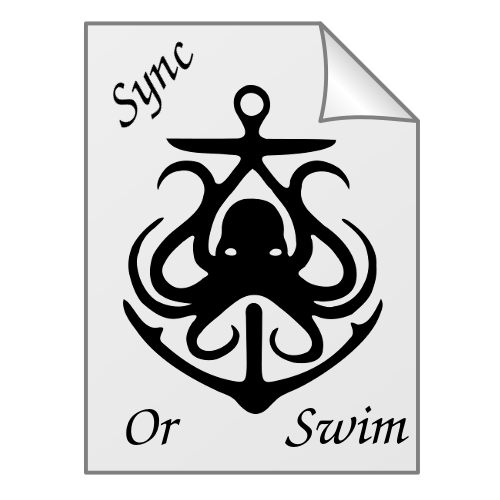

# SyncOrSwim
A simple, fast, and secure file syncing application. SyncOrSwim seeks to solve a number of problems in existing file syncing applications: the lack of support for end-to-end encryption controlled locally by the user and the lack of control of where the file is placed remotely.

## ZenHub
We will be using the Chrome extension ZenHub to create and manage issue tracking for this project. All major additions and changes will be created as issues on ZenHub and placed on the issue board. Management of issues will be primarily on an individual basis, but it is highly encouraged to discuss with the team first on Slack before handling new or old issues.

In order to utilize ZenHub, we primarily work/contribute to this git repository on GitHub at [QuentinCovert/SyncOrSwim](https://github.com/QuentinCovert/SyncOrSwim).

## Usage
1. Unzip the SyncOrSwim folder, available at (blah).
2. Install SQLAlchemy3.4, PyQt4, and Watchman. These can be found at: http://www.sqlalchemy.org/download.html, https://sourceforge.net/projects/pyqt/, and https://github.com/facebook/watchman/tree/master/python.
3. Using Python 3.4.1, execute the Main module with the following command: Path\To\Python34\PythonApplication main.py 
4. Follow the on-screen instructions to begin syncing files.

## Repository Structure
- Diagrams
  - Figures showing use cases, class diagrams, or sequence diagrams
- Docs
  - Documents of the project
- Minutes
  - Summaries of meetings (virtual or physical), including date, length, and attendance.
- Src
  - Location of source code for the program. Each module will be under their own subdirectory under this directory.

## Contributing
1. Clone repo to local computer using `git clone`.
2. If adding or editing files in the `docs` directory, just make commits in the `master` branch.
3. If adding or changing a feature, create a new branch with the following naming convention: `issue#_briefdesc_branch`.
4. `git checkout` into the new branch and make the commits there, instead of the `master` branch.
5. When the code is stable and clean, make a pull request into `master` branch for code review.

## Contributors
* Levi Amen
* Cameron Johnson
* Quentin Covert
* Collin Victor
* Mark Hernandez

## License
This is an open source project under GPL.
